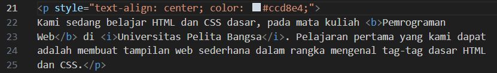

# Lab2web
## Nama  : Muhamad Ananda Putra Fraceda
## NIM   : 312310440
## Kelas : TI.23.A4
## 1. Membuat dokumen HTML.
- Gambar1
  
- Gambar2
  
# 2. Mendeklarasikan CSS Internal
- Gambar1
  
- Gambar2
   
# 3. Menambahkan Inline CSS
- Gambar1
  
- Gambar2
  
# 4. Membuat CSS Eksternal
- Gambar1
  
- Gambar2
 
# 5. Menambahkan CSS Selector
- Gambar1
  
- Gambar2
  
 
